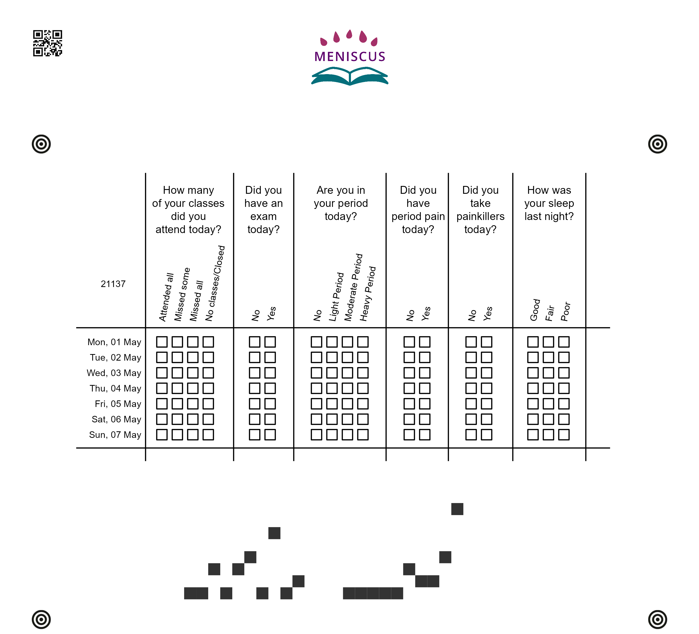
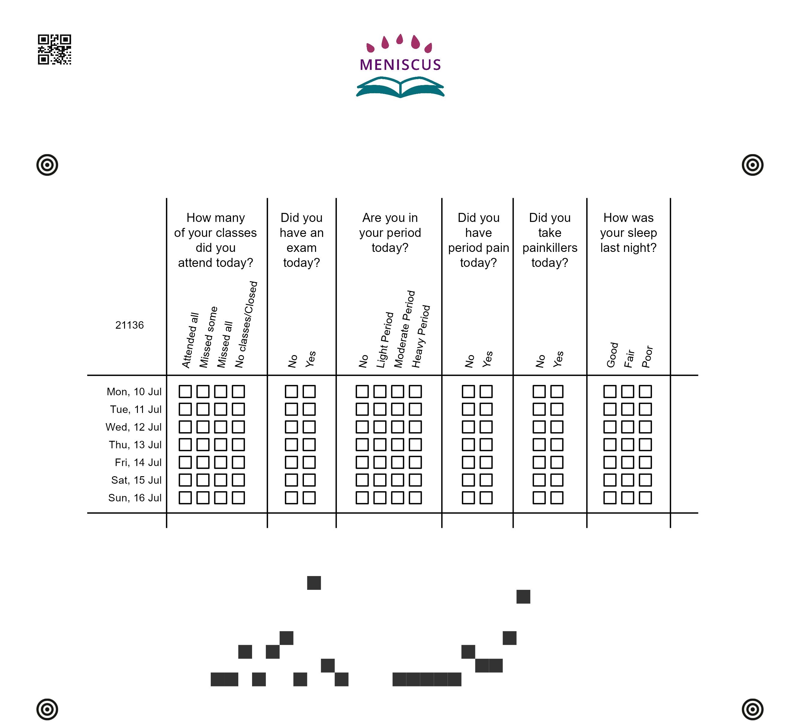

\centering 
{width=90%}

\newpage 
 

\newpage

\newpage 

 

\newpage

 \newpage 
 

\newpage

 \newpage 
 

\newpage

 \newpage 
 

\newpage

 \newpage 
 

\newpage

 \newpage 
 

\newpage

 \newpage 
 

\newpage

 \newpage 
 

\newpage

 \newpage 
 

\newpage

 \newpage 
 

\newpage

 \newpage 
 

\newpage

 \newpage 
 

\newpage

 \newpage 
 

\newpage

 \newpage 
 

\newpage

 \newpage 
 

\newpage

 \newpage 
 

\newpage

 \newpage 
 

\newpage

 \newpage 
 

\newpage

 \newpage 
 

\newpage

